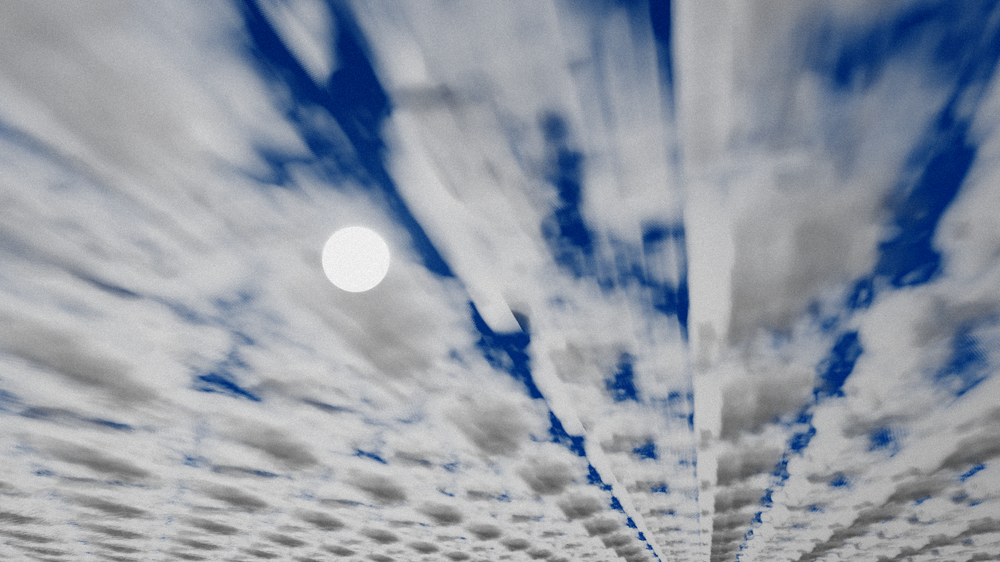

# cloud9 - Executable Graphics Entry for Outline 2026 demoparty

Volumetric clouds ray-marching with DX11 compute shaders based on "Physically Based Sky, Atmosphere and Cloud Rendering in Frostbite" by Sebastien Hillaire. Produces executable graphics output (compressed) of about ~2384 bytes in size. 

More info and downloads at: [https://a-lex.dev/2026/05/17/clouds/](https://a-lex.dev/2026/05/17/clouds/)